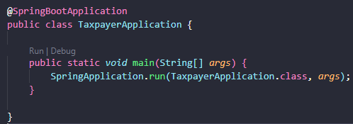

# Tax Payer

## Descrição Geral

Projeto inspirado em uma atividade da aula 166 do curso [Java COMPLETO Programação Orientada a Objetos +Projetos
](https://www.udemy.com/course/java-curso-completo/), ministrado pelo professor Nélio Alves.

<p>Projeto adaptado com o intuito do estudo do framework Spring Boot e também sobre serviço de mensageria para envio de email.</p>

### Descrição do projeto:

Api para realizar cadastro de atributos que podem ser pessoa física *Individual* ou pessoa jurídica *Company*, e depois mostrar o valor do imposto pago por cada.

Os dados de pessoa física são: nome, renda anual e gastos com saúde.

Os dados de pessoa jurídica são nome, renda anual e número de funcionários.

As regras para cálculo de imposto são as seguintes:

Pessoa física: pessoas cuja renda foi abaixo de 20000.00 pagam 15% de imposto. Pessoas com 
renda de 20000.00 em diante pagam 25% de imposto. Se a pessoa teve gastos com saúde, 50% 
destes gastos são abatidos no imposto. Exemplo: uma pessoa cuja renda foi 50000.00 e teve 2000.00 em gastos com saúde, o imposto fica: (50000 * 25%) - (2000 * 50%) = 11500.00.

Pessoa jurídica: pessoas jurídicas pagam 16% de imposto. Porém, se a empresa possuir mais de 10 
funcionários, ela paga 14% de imposto. 
Exemplo: uma empresa cuja renda foi 400000.00 e possui 25 funcionários, o imposto fica: 
400000 * 14% = 56000.00


O projeto consiste em fazer uma api utilizando o [Spring Boot](https://code.visualstudio.com/docs/java/java-spring-boot) com todas as relações **CRUD** e também um serviço de mesageria para **envio de email** do valor total do imposto.

### EndPoints do projeto:
- Lista de endPoints: / [GET]

#### Para Pessoa Física:
- Cadastro: /individual/register [Post] Abaixo segue request:
``` Json Body
{
    "name": "string",
    "email": "string",
    "anualIncoming": "double",
    "healthExpenditures": "double",
}
```
- Listar: /individual [Get]
- Encontrar por nome: /individual/{name} [Get]
- Atualizar: /individua/update/{id} [Put] Abaixo segue request:
``` Json Body
{
    "anualIncoming": "double",
    "healthExpenditures": "double",
}
```
- Remover: /individual/remove/{id} [Delete]

#### Para Pessoa Jurídica:
- Cadastro: /company/register [Post] Abaixo segue request:
``` Json Body
{
    "name": "string",
    "email": "string",
    "anualIncoming": "double",
    "numbersOfEmployees": "integer",
}
```
- Listar: /company [Get]
- Encontrar por nome: /company/{name} [Get]
- Atualizar: /company/update/{id} [Put] Abaixo segue request:
``` Json Body
{
    "anualIncoming": "double",
    "numbersOfEmployees": "integer",
}
```
- Remover: /company/remove/{id} [Delete]

#### Para Email:
- Enviar: /email/sending [Post] Abaixo segue request:
``` Json Body
{
    // Proprietário - atribute name
    "ownerRef": "string",
    "emailTo": "string",
    "subject": "string",
    // INDIVIDUAL (Pessoa Física) ou COMPANY (Pessoa Jurídica)
    "whoTaxPayer": "string",
}
```
- Listar: /email/listAll [Get]

### Descrição - Executar Api localmente:
- Para clonar o projeto: git clone https://github.com/TaylanTorres09/taxPayer-api
- Para Executar o projeto precisasse:
    - Java [JDK](https://www.oracle.com/java/technologies/downloads/#java17). Este projeto está usando a versão 17.
    - Banco [H2](https://www.h2database.com/html/main.html) utilizado em memória.

- Extensões do vscode utilizadas:
    - [Debugger for Java](https://marketplace.visualstudio.com/items?itemName=redhat.java)
    - [Spring Boot Extension Pack](https://marketplace.visualstudio.com/items?itemName=Pivotal.vscode-boot-dev-pack)
    - [Lombok Annotations Support for VS Code](https://marketplace.visualstudio.com/items?itemName=vscjava.vscode-lombok)

- Nos campos vazios de **username** e **password** siga o tutorial da google: https://support.google.com/accounts/answer/185833 / Coloque se usuário de email e a senha de 16 digitos geradas.


- Na pasta src/main, execute o arquivo TaxpayerApplication.java



- Para testar a api você pode utilizar ferramentas de client como:
    - [Postman](https://www.postman.com/)
    - [Insomnia](https://insomnia.rest/download)
    - Extensão do VsCode [Thunder Client](https://marketplace.visualstudio.com/items?itemName=rangav.vscode-thunder-client)
    - Ou outra de sua preferência.

### Próximos Passos
- Ainda no cadastro fazer verificação por email com geração de código de validação.
- Criar sessão por usuário.
- Fazer interfaces no front-end.

## Autor
<a href="https://www.linkedin.com/in/taylan-torres" target="_blank"></a> 